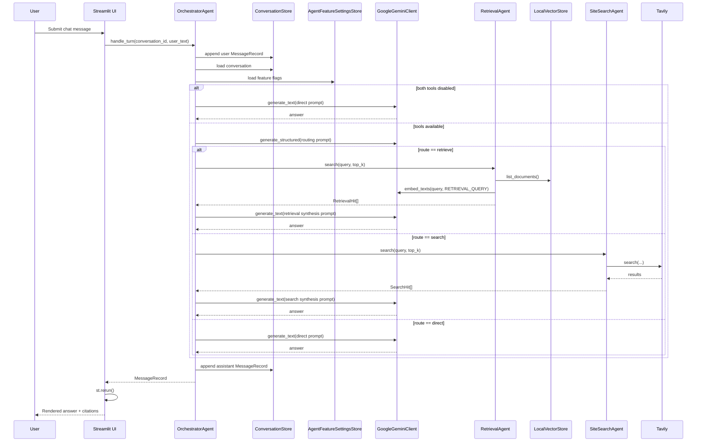
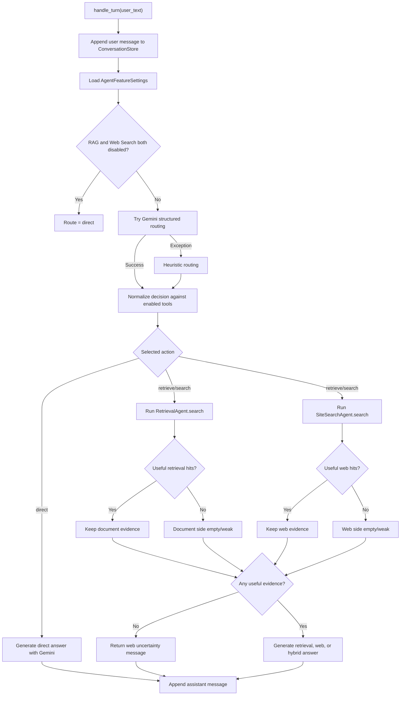

# ESILV Smart Assistant Pipeline

This document describes the current runtime orchestration pipeline implemented in this repository as of the inspected codebase state. It is intentionally code-grounded: it documents what the application does now, not the architecture that may have been planned earlier.

Two important framing points:

1. There is no separate backend API server. The application entrypoint is the Streamlit script in `app/main.py`.
2. The system currently has four runtime answer paths:
   - `direct`: Gemini answers without retrieval
   - `retrieve`: local PDF RAG over the JSON-backed vector store
   - `search`: ESILV website search via Tavily plus a local query cache
   - `super`: an iterative orchestration layer over `retrieve`, `search`, or `hybrid` when `super_agent_enabled` is on

## Observed Runtime State

The following was verified from the current local environment during documentation:

- `GEMINI_API_KEY` is configured.
- `TAVILY_API_KEY` is configured.
- `data/agent_settings.json` currently contains:

```json
{
  "rag_enabled": true,
  "web_search_enabled": true,
  "super_agent_enabled": true,
  "generation_model": "gemini-2.5-flash",
  "embedding_model": "gemini-embedding-001"
}
```

- The local vector store currently contains 3 indexed documents.
- A live retrieval probe on `According to the uploaded PDF, what are the admissions office hours?` returned 3 hits, with `admissions.pdf` page 1 ranked first.
- A live Tavily-backed search probe on `How do ESILV admissions work?` returned 3 hits, with `https://www.esilv.fr/admissions/` ranked first.

These observations confirm that both retrieval backends are configured locally, while the current feature-flag seed keeps web search and Super Agent disabled until explicitly enabled in the admin UI.

## 1. High-Level Architecture

### 1.1 Runtime building blocks

The application is a single-process Streamlit app composed in `app/runtime.py:build_services`.

Major components:

- UI shell:
  - `app/main.py:main`
  - `ui/components.py`
  - `ui/chat_page.py:render_chat_page`
  - `ui/admin_page.py:render_admin_page`
- Orchestration:
  - `agents/orchestrator.py:OrchestratorAgent`
- RAG retrieval:
  - `agents/retrieval.py:RetrievalAgent`
  - `ingestion/pdf_ingestion.py:PdfIngestionService`
  - `ingestion/vector_store.py:LocalVectorStore`
- Web search:
  - `agents/web_search.py:SiteSearchAgent`
- Persistence:
  - `app/conversation_store.py:ConversationStore`
  - `app/agent_settings.py:AgentFeatureSettingsStore`
  - `ingestion/uploads.py:UploadRegistry`
  - `ingestion/vector_store.py:LocalVectorStore`
- Models and schemas:
  - `app/models.py`
- Provider integrations:
  - `agents/orchestrator.py:GoogleGeminiClient`
  - `ingestion/pdf_ingestion.py:GoogleEmbeddingClient`
  - `agents/web_search.py:TavilyClient`

### 1.2 Composition root

`app/runtime.py:build_services` constructs the full object graph on each Streamlit run:

- `ConversationStore`
- `AgentFeatureSettingsStore`
- `UploadRegistry`
- `LocalVectorStore`
- `GoogleEmbeddingClient`
- `PdfIngestionService`
- `RetrievalAgent`
- `SiteSearchAgent`
- `GoogleGeminiClient`
- `OrchestratorAgent`

This means Streamlit reruns rebuild service objects, but state survives because all persistent state is file-backed under `data/`.

During service construction, `app/runtime.py:build_services` now resolves the effective Gemini models in this order:

1. persisted admin selection from `data/agent_settings.json`
2. fallback environment defaults from `GEMINI_MODEL` and `GEMINI_EMBEDDING_MODEL`

The selected generation model is shared by the orchestrator and Super Agent generation/evaluation calls, and the selected embedding model is shared by ingestion plus retrieval query embeddings.

### 1.3 No backend API layer

There is no HTTP API or FastAPI/Flask service. The effective "entrypoint" for user requests is the `st.chat_input(...)` event in `ui/chat_page.py:render_chat_page`, which directly calls `orchestrator.handle_turn(...)`.

### 1.4 Storage layers

The app uses JSON files, not a database:

- Conversations: `data/conversations/<conversation_id>.json`
- Agent feature flags: `data/agent_settings.json`
- Uploaded PDF registry: `data/uploads/registry.json`
- Raw uploaded PDFs: `data/uploads/files/<uuid>.pdf`
- Docling model artifacts: `data/docling_artifacts/`
- Vector store documents: `data/vector_store/documents/<document_id>.json`
- Web search query cache: `data/site_cache/queries/query_<sha256-prefix>.json`

### 1.5 Prompt construction layers

Prompts are built in `agents/orchestrator.py`:

- Routing prompt: `OrchestratorAgent._route`
- Direct answer prompt: `OrchestratorAgent._direct_answer`
- Search-grounded synthesis prompt: `OrchestratorAgent._grounded_answer`
- Retrieval-grounded synthesis prompt: `OrchestratorAgent._retrieval_answer`
- Hybrid synthesis prompt: `OrchestratorAgent._hybrid_answer`
- Shared system instruction: `SYSTEM_PROMPT`

The iterative evaluator prompt for Super Agent is built in `agents/super_agent.py:SuperAgent._evaluate_iteration`.

### 1.6 Tool invocation layer

There is no model-native tool calling or function-calling orchestration loop. Tool invocation is ordinary Python branching:

- `retrieve` branch -> `RetrievalAgent.search`
- `search` branch -> `SiteSearchAgent.search`
- `super` branch -> `SuperAgent.run`, which in turn executes `retrieve`, `search`, or both with explicit loop control
- `direct` branch -> no tool

The LLM is used to choose a route and to synthesize the final answer, but it does not itself call tools through a tool API.

### 1.7 Response formatting and streaming

No token streaming is implemented.

Runtime behavior:

- `ui/chat_page.py:render_chat_page` calls `orchestrator.handle_turn(...)` synchronously inside `st.spinner("Thinking...")`
- the assistant message is persisted
- `st.rerun()` refreshes the page
- prior messages are rendered with `st.chat_message`
- citations are rendered as:
  - clickable links for web citations
  - plain `filename, page N` labels for document citations

## 2. End-to-End Execution Flow

### 2.1 Numbered message lifecycle

1. User enters text in `ui/chat_page.py:render_chat_page` through `st.chat_input(...)`.
2. The UI calls `agents/orchestrator.py:OrchestratorAgent.handle_turn(selected_conversation_id, user_text)`.
3. `handle_turn` immediately creates a `MessageRecord(role="user", content=user_text)` and appends it to the conversation via `app/conversation_store.py:ConversationStore.append_message`.
4. `handle_turn` reloads the full conversation from disk with `ConversationStore.load`.
5. If Gemini is not configured (`llm_client.configured` is false), the method returns a configuration error message immediately and does not attempt routing, retrieval, or search.
6. The orchestrator loads global feature flags from `app/agent_settings.py:AgentFeatureSettingsStore.load`.
7. Routing occurs in `OrchestratorAgent._route(messages, user_text, feature_settings)`.
8. `_route` first short-circuits to `direct` if both `rag_enabled` and `web_search_enabled` are false.
9. Otherwise `_route` attempts an LLM-based structured routing decision using Gemini (`GoogleGeminiClient.generate_structured`) with schema `RoutingDecision`.
10. If structured routing fails for any reason, `_route` falls back to `OrchestratorAgent._heuristic_route`.
11. The route is normalized against enabled features by `_normalize_decision`. If the LLM selected a disabled action, `_fallback_for_disabled_action` coerces the route to either another tool or `direct`.
12. Back in `handle_turn`, direct requests still go straight to `_direct_answer`.
13. When `super_agent_enabled` is false and both RAG and web search are enabled, standard mode uses a deterministic hybrid path:
    - run `RetrievalAgent.search` and `SiteSearchAgent.search` in the same turn
    - if both are useful -> synthesize a hybrid answer from document and web snippets
    - if only one side is useful -> answer from that stronger source only
    - if both are weak -> return the search clarification flow with an optional `pending_query`
14. When only one external tool is enabled, standard mode uses only that tool and returns its normal answer or clarification behavior.
15. When `super_agent_enabled` is true and the route is non-direct, control is delegated to `SuperAgent.run(...)`.
15. If the user later replies with an affirmative follow-up such as `yes` and the previous assistant message carried a `pending_action` + `pending_query`, `_follow_up_decision(...)` bypasses normal routing and reruns the suggested tool/query directly.
16. Any exception inside the selected branch is caught by `handle_turn`, which returns `_temporary_failure_message(...)`.
17. The assistant response is appended to the conversation JSON via `ConversationStore.append_message`.
18. Control returns to `ui/chat_page.py`, which calls `st.rerun()`.
19. Streamlit rerenders the conversation and displays the new assistant message and its citations.

### 2.2 Mermaid sequence diagram



## 3. Orchestration Logic in Detail

This is the core routing layer. It lives entirely in `agents/orchestrator.py`.

### 3.1 Where routing is implemented

Primary entrypoint:

- `agents/orchestrator.py:OrchestratorAgent.handle_turn`

Routing helpers:

- `OrchestratorAgent._route`
- `OrchestratorAgent._follow_up_decision`
- `OrchestratorAgent._normalize_decision`
- `OrchestratorAgent._fallback_for_disabled_action`
- `OrchestratorAgent._heuristic_route`
- `OrchestratorAgent._allowed_actions`

### 3.2 What kind of router this is

The router is a combination of:

- feature-flag gating
- LLM-based structured routing
- heuristic fallback routing
- post-routing normalization against enabled tools

It is not purely rule-based and not purely model-driven.

#### Pre-routing deterministic gating

`_route` immediately returns `RoutingDecision(action="direct")` when:

- `feature_settings.rag_enabled == False`
- `feature_settings.web_search_enabled == False`

In that case there is no LLM routing call at all.

#### Primary routing mode: Gemini structured output

When at least one tool is enabled, `_route` builds a prompt containing:

- allowed actions for this turn
- tool availability guidance derived from feature flags
- last 8 conversation messages
- the latest user message

It then calls:

- `GoogleGeminiClient.generate_structured(...)`
- response schema: `RoutingDecision`
- temperature: `0.0`

This makes routing model-driven, but constrained by:

- allowed action list from `_allowed_actions`
- follow-up normalization in `_normalize_decision`

#### Fallback mode: heuristics

If `generate_structured` raises any exception, `_route` falls back to `_heuristic_route`.

This fallback is directly relevant in the current app because Gemini quota or transport failures can happen. In those cases routing still proceeds deterministically from the heuristics.

### 3.3 Signals used for route selection

#### Conversation history influence

Routing sees the last 8 messages through:

- `OrchestratorAgent._format_messages(messages[-8:])`

Important implementation detail:

- `handle_turn` appends the current user message before calling `_route`
- `_route` also separately includes `Latest user message:\n{user_text}`

So the current user turn appears twice in the routing prompt:

- once in the serialized conversation history
- once again as the dedicated latest message block

That is directly verified from the code order in `handle_turn` and `_route`.

#### Heuristic route signals

`_heuristic_route` uses three signal families:

- greeting / conversational opener detection:
  - `DIRECT_STARTERS`
- retrieval intent detection:
  - `RETRIEVE_KEYWORDS`
- web search intent detection:
  - `SEARCH_KEYWORDS`

Relevant constants:

- `DIRECT_STARTERS = ("hello", "hi", "hey", "thanks", "thank you", "bonjour", "salut", "merci")`
- `RETRIEVE_KEYWORDS` includes `pdf`, `document`, `documents`, `report`, `uploaded`, `internal`, `according to`, `dans le document`, `rapport`, `fichier`
- `SEARCH_KEYWORDS` includes `esilv`, `admission`, `program`, `course`, `campus`, `tuition`, `deadline`, `application`, `website`, `site`, etc.

Heuristic ordering:

1. If the message starts with a direct starter and contains no `?`, route `direct`
2. Else if RAG is enabled and retrieval intent is detected, route `retrieve`
3. Else if web search is enabled and search intent is detected, route `search`
4. Else if retrieval intent exists but retrieval is disabled, call `_fallback_for_disabled_action("retrieve", ...)`
5. Else if search intent exists but search is disabled, call `_fallback_for_disabled_action("search", ...)`
6. Else route `direct`

This ordering matters. When both tools are enabled and the heuristic fallback is active, retrieval intent is checked before search intent.

### 3.4 Feature-flag-aware normalization

Tool availability is controlled globally by `AgentFeatureSettings`:

- `rag_enabled`
- `web_search_enabled`

Those are loaded from `data/agent_settings.json` by `AgentFeatureSettingsStore.load()` on every turn.

Normalization logic:

- `OrchestratorAgent._allowed_actions(feature_settings)` constructs the allowed action set.
- `OrchestratorAgent._normalize_decision(...)` checks whether the LLM-selected action is allowed.
- If not allowed, `_fallback_for_disabled_action(...)` is applied.

#### Disabled retrieval fallback

If the LLM chose `retrieve` while `rag_enabled` is false:

- if web search is enabled and `_has_independent_search_intent(lowered)` is true -> route `search`
- otherwise -> route `direct`

`_has_independent_search_intent(lowered)` means:

- `_is_search_intent(lowered)` is true
- `_is_document_anchored_request(lowered)` is false

Document-anchored phrases include:

- `according to the uploaded`
- `according to the pdf`
- `uploaded pdf`
- `dans le document`
- `dans le pdf`

So a document-grounded request usually does not fall back from disabled RAG into web search unless it also contains independent ESILV website intent.

#### Disabled web search fallback

If the LLM chose `search` while `web_search_enabled` is false:

- if RAG is enabled and `_is_retrieval_intent(lowered)` is true -> route `retrieve`
- otherwise -> route `direct`

### 3.5 Search vs RAG: exact branch behavior

#### Can both be used in one request?

Yes.

`RoutingDecision.action` is a single literal:

- `direct`
- `retrieve`
- `search`

In standard mode:

- `direct` still stays direct
- if both RAG and web search are enabled and the routed action is non-direct, the orchestrator always runs both tools in the same pass
- if only one tool is enabled, standard mode stays single-tool

In Super Agent mode, `handle_turn` still routes to a single non-direct entry action, but then delegates to `SuperAgent.run(...)`, which can:

- iterate up to 3 times
- use `retrieve`, `search`, or `hybrid`
- compare the draft answer against the original user question
- rewrite the query and retry
- carry forward accumulated document/web hits from previous iterations into later generations
- merge document and web citations in the final answer

#### What happens when RAG returns weak or empty results?

Weak retrieval is implemented in `agents/retrieval.py:RetrievalAgent.is_weak`.

Retrieval is considered weak when:

- there are no hits, or
- `top_hit.score < 0.58` and `top_hit.lexical_overlap < 0.15`

If retrieval is weak:

- with both tools enabled, the system still keeps the web-search side of the same turn/iteration
- with only RAG enabled, the orchestrator returns an interactive clarification message
- in Super Agent mode, the combined loop can rewrite the query and retry with both tools again

#### What happens when web search returns weak or empty results?

Weak web search is implemented in `agents/orchestrator.py:OrchestratorAgent._search_is_weak`.

Search is considered weak when:

- there are no hits, or
- `hits[0].score < 4`, or
- `hits[0].expanded_overlap < 0.18`, or
- the query matches a built-in clarification suggestion and `hits[0].lexical_overlap < 0.2`

If search is weak:

- standard mode returns an interactive clarification message
- that message can carry `pending_action="search"` and a refined `pending_query`
- Super Agent can still continue iterating if retry budget remains

#### How many chunks / hits are returned?

The effective top-k for both retrieval and search is `max_search_hits`, which is passed into the orchestrator from `AppSettings.max_search_hits` and defaults to `5`.

So, in the current implementation:

- `RetrievalAgent.search(..., top_k=self.max_search_hits)` returns at most 5 `RetrievalHit` items by default
- `SiteSearchAgent.search(..., top_k=self.max_search_hits)` returns at most 5 `SearchHit` items by default

#### Minimum threshold scores

Currently implemented thresholds:

- Retrieval weak threshold:
  - `score < 0.58`
  - and `lexical_overlap < 0.15`
- Search weak threshold:
  - `score < 4`

These are hardcoded heuristic thresholds, not calibrated probabilities.

### 3.6 What happens on failures

There are two failure layers:

1. Routing-time failure:
   - `OrchestratorAgent._route` catches exceptions from Gemini structured routing
   - fallback: `_heuristic_route`

2. Execution-time failure inside the chosen branch:
   - `handle_turn` wraps the branch body in `try/except Exception`
   - on any exception, returns `_temporary_failure_message(...)`

So the user-visible message:

- `The generation service is temporarily unavailable. Please try again in a moment.`

can be triggered by any exception in the selected execution branch, including:

- Gemini text generation failures
- retrieval failures
- search failures

The message text mentions generation, but the exception handler is broader than generation only.

### 3.7 Routing flowchart



## 4. RAG Pipeline Breakdown

### 4.1 Ingestion entrypoint

Document ingestion is initiated from the admin UI:

- `ui/admin_page.py:_render_upload_section`

For each uploaded file:

- `PdfIngestionService.ingest(uploaded_file)` is called

### 4.2 Upload persistence

`ingestion/uploads.py:UploadRegistry.save`:

- validates file extension against `ALLOWED_EXTENSIONS = {".pdf"}`
- generates a UUID document ID
- writes raw bytes to `data/uploads/files/<uuid>.pdf`
- appends a `UploadedDocumentRecord` to `data/uploads/registry.json`

### 4.3 PDF parsing

`ingestion/pdf_ingestion.py:PdfIngestionService.extract_pdf_chunks` uses Docling:

- `DocumentConverter`
- `PdfFormatOption`
- `PyPdfiumDocumentBackend`
- `PdfPipelineOptions`

Runtime configuration in `_docling_converter_for_ingestion`:

- backend: `PyPdfiumDocumentBackend`
- `do_ocr = False`
- `do_table_structure = False`
- code/formula/picture/chart enrichment disabled
- `layout_batch_size = 1`
- `generate_parsed_pages = False`

Important implementation detail:

- the ingestion service pre-downloads Docling layout artifacts into `data/docling_artifacts/`
- `_ensure_docling_models()` calls `docling.utils.model_downloader.download_models(...)`
- only the layout model family is downloaded for this pipeline

The code intentionally uses `PyPdfiumDocumentBackend` instead of Docling's parse backend because the provided real PDF `data/pdfs/esilv_syllabus_ccc.pdf` parsed successfully with PyPdfium, while the parse backend was observed to fail with partial output on the same file.

### 4.4 Chunking strategy

Chunking is now delegated to Docling's `HybridChunker`:

- `PdfIngestionService._docling_chunker_for_ingestion`
- `parsed_chunks_from_docling_chunks`

Chunk conversion behavior:

- each Docling chunk is normalized with `normalize_text`
- page provenance is extracted from `chunk.meta.doc_items[*].prov[*].page_no`
- the current vector-store schema only supports one `page_number` per chunk, so multi-page Docling chunks are anchored to their earliest source page
- `chunk_index` is assigned sequentially per stored page number to preserve the existing backend contract

This keeps the downstream indexing format unchanged while replacing the parser/chunker implementation.

### 4.5 Embedding generation

Embeddings are produced in `ingestion/pdf_ingestion.py:GoogleEmbeddingClient.embed_texts`.

Implementation details:

- provider: Gemini embeddings through `google-genai`
- model: `GEMINI_EMBEDDING_MODEL`, default `gemini-embedding-001`
- ingestion task type: `RETRIEVAL_DOCUMENT`
- query task type at retrieval time: `RETRIEVAL_QUERY`
- output dimensionality: `768`
- batch size: `20`

### 4.6 Vector store layout

The vector index is a local JSON store in `ingestion/vector_store.py:LocalVectorStore`.

Storage format:

- one JSON file per indexed document under `data/vector_store/documents/`
- each document file stores:
  - `document_id`
  - `filename`
  - `indexed_at`
  - `page_count`
  - `chunk_count`
  - `chunks`
- each chunk stores:
  - `id`
  - `document_id`
  - `filename`
  - `page_number`
  - `chunk_index`
  - `text`
  - full embedding vector

Compatibility note:

- Docling can emit chunks spanning multiple source pages
- the persisted schema still stores only one `page_number`
- the ingestion layer therefore projects each chunk onto its earliest provenance page before indexing
- no vector-store schema change was introduced in this refactor

This is a brute-force store, not an ANN index. Retrieval reads all indexed documents and compares the query embedding against every chunk embedding.

### 4.7 Retrieval execution

Retrieval is implemented in `agents/retrieval.py:RetrievalAgent.search`.

Algorithm:

1. Load all indexed documents from `LocalVectorStore.list_documents()`
2. Flatten all chunks with `_all_chunks()`
3. If there are no chunks, return `[]`
4. If the embedding client is not configured, return `[]`
5. Embed the user query with `task_type="RETRIEVAL_QUERY"`
   - before embedding, `RetrievalAgent.expand_query(...)` adds deterministic expansions such as `sql -> database / relational database / bases de donnees`
6. Tokenize the query with `tokenize(...)`
7. For each chunk:
   - compute cosine similarity
   - compute lexical overlap ratio between query tokens and chunk tokens
   - compute final score:

```text
final_score = cosine_score + (0.08 * overlap_ratio)
```

8. Drop hits with `final_score <= 0`
9. Sort by:
   - `score`
   - then `lexical_overlap`
   - then `cosine_score`
10. Return `top_k`

### 4.8 RAG ranking details

Ranking fields on `RetrievalHit`:

- `score`
- `cosine_score`
- `lexical_overlap`

Current thresholds:

- weak if `score < 0.58` and `lexical_overlap < 0.15`

Metadata filtering:

- none

Document scoping:

- global across all indexed PDFs

Per-document filtering:

- not implemented

Reranker model:

- not implemented

### 4.9 Context assembly for answer generation

Retrieved snippets are formatted in `OrchestratorAgent._retrieval_answer` as:

- `Source N`
- `Document: <filename>`
- `Page: <page_number>`
- `Snippet: <snippet>`

The answer prompt explicitly tells Gemini:

- use only the uploaded-document snippets below
- state limitations if they do not fully answer the question
- do not invent details

This is prompt-level grounding only. There is no hard validation that the model obeyed it.

### 4.10 Citations

Document citations are created by:

- `OrchestratorAgent._citations_from_retrieval_hits`

Dedup behavior:

- unique by `(filename, page_number)`
- capped to first 3 citations

Rendered form in the UI:

- `filename, page N`

No chunk ID, text span, or clickable document link is exposed in chat.

## 5. Web Search Pipeline Breakdown

### 5.1 Search trigger

Search is triggered only when the orchestrator selects the `search` route and `web_search_enabled` is true.

Entry path:

- `OrchestratorAgent.handle_turn`
- branch: `elif decision.action == "search" and feature_settings.web_search_enabled`

### 5.2 Provider and transport

Search is implemented by `agents/web_search.py:SiteSearchAgent`.

Provider:

- Tavily via `tavily.TavilyClient`

Transport/session:

- `requests.Session`
- user-agent: `ESILVSmartAssistant/0.2 (+local-demo)`

Configured through:

- `TAVILY_API_KEY`

### 5.3 Actual search model vs earlier architecture assumptions

The current implementation does not crawl the ESILV website, does not parse HTML pages, and does not maintain a page-level website corpus.

Instead, it:

- issues live Tavily searches restricted to ESILV domains
- caches query results locally
- ranks Tavily results with an in-process lexical scoring function

This is important because it differs materially from a sitemap crawler design.

### 5.4 Query normalization and caching

Search path:

- `SiteSearchAgent.search(query, top_k)`
- delegates to `_search(query, top_k, force_refresh=False)`

Steps:

1. Normalize query with `_normalize_query`:
   - accent stripping
   - lowercasing
   - whitespace normalization
2. Look for cached record in `data/site_cache/queries/query_<digest>.json`
3. If cached and not stale, return cached results
4. If no Tavily key:
   - return cached results if available
   - else return `[]`
5. If Tavily is configured:
   - expand the query
   - send live search request
   - build and rank `SearchHit` objects
   - write `SearchCacheRecord`

Cache key:

- `sha256(normalized_query)[:16]`

### 5.5 Query expansion

`SiteSearchAgent._expand_query` builds an expanded query string by:

- always prepending `ESILV`
- preserving the original query text
- adding token-based expansions from `QUERY_EXPANSIONS`
- adding extra finance-specific phrases when `finance` is present

Examples of built-in expansions:

- `finance` -> `financial engineering`, `ingenierie financiere`
- `campus` -> `paris la defense`, `la defense campus`
- `admission` -> `admissions`, `concours avenir`

### 5.6 Domain filtering

The agent receives `allowed_domains` from settings, but `_normalize_allowed_domains` keeps only domains whose string contains `esilv.fr`.

Consequence:

- even though `AppSettings.allowed_domains_raw` defaults to `esilv.fr,www.esilv.fr,devinci.fr,www.devinci.fr`
- the search agent will effectively keep only ESILV domains

This is verified by the implementation and by `tests/test_web_search.py`.

### 5.7 Tavily request payload

Current live search payload fields in `_search`:

- `query`: expanded query
- `search_depth`: `advanced`
- `chunks_per_source`: `3`
- `topic`: `general`
- `country`: `france`
- `max_results`: `min(max(top_k * 3, 8), 12)`
- `include_answer`: `False`
- `include_raw_content`: `False`
- `include_domains`: normalized ESILV domains

### 5.8 Search result ranking

Raw Tavily results are converted to `SearchHit` in `_build_hits`.

Ranking inputs:

- Tavily `score`
- title text
- content text
- URL text
- original query tokens
- expanded query tokens
- a hardcoded finance-major bonus

Current score formula in `_rank_result`:

```text
round((base_score * 10.0) + lexical_score + finance_major_bonus, 4)
```

Where `lexical_score` includes weighted counts:

- title/query token count * 2.5
- content/query token count * 1.5
- url/query token count * 1.0
- title/expanded token count * 1.2
- content/expanded token count * 0.8
- url/expanded token count * 0.8

The `finance_major_bonus` can add up to `12.0` for finance-major queries.

### 5.9 Web context assembly

Search answer synthesis is done in `OrchestratorAgent._grounded_answer`.

Each hit is formatted as:

- `Source N`
- `Title: ...`
- `URL: ...`
- `Snippet: ...`

The prompt tells Gemini:

- use only the source snippets below
- if they do not fully answer the question, state the limitation
- do not invent details

Again, this is prompt-level grounding, not post-validated grounding.

### 5.10 Search citations

Web citations are built by `OrchestratorAgent._citations_from_hits`.

Behavior:

- dedupe by URL
- keep first 3 unique URLs
- render as clickable links in the chat UI

### 5.11 Web search failure behavior

Behavioral layers:

- `_search_tavily` retries `requests.RequestException` up to 2 attempts with exponential backoff
- if no Tavily key exists and cached results are present, cached results are returned
- if no Tavily key and no cache exists, `[]` is returned
- if the search branch raises an exception in `handle_turn`, the user gets `_temporary_failure_message(...)`
- if search returns no/weak hits, the user gets `_uncertain_message(...)`

There is no fallback from weak/empty search into RAG.

### 5.12 Refresh and cache warmup

Admin-triggered refresh uses `SiteSearchAgent.refresh_cache`.

It runs a set of warmup queries defined in `DEFAULT_WARMUP_QUERIES`, currently 6 queries such as:

- `ESILV admissions concours avenir`
- `ESILV campus Paris La Defense`
- `ESILV cycle ingenieur majeures`

`refresh_cache(limit=25)` iterates over those warmup queries and calls `_search(..., force_refresh=True)`.

## 6. Decision Matrix

| Condition / signal | Code location | Selected path | Notes |
| --- | --- | --- | --- |
| `rag_enabled == false` and `web_search_enabled == false` | `agents/orchestrator.py:OrchestratorAgent._route` | `direct` | No LLM routing call is made. |
| Gemini structured routing succeeds with `action="retrieve"` and RAG enabled | `agents/orchestrator.py:OrchestratorAgent.handle_turn` | `retrieve` | If both tools are enabled, standard mode still runs both retrieval and web search before answering. |
| Gemini structured routing succeeds with `action="search"` and web search enabled | `agents/orchestrator.py:OrchestratorAgent.handle_turn` | `search` | If RAG is also enabled, standard mode still runs both retrieval and web search before answering. |
| Gemini structured routing succeeds with `action="direct"` | `agents/orchestrator.py:OrchestratorAgent.handle_turn` | `direct` | Uses Gemini general response path. |
| Gemini structured routing fails | `agents/orchestrator.py:OrchestratorAgent._route` | heuristic | Falls back to keyword-based route selection. |
| Heuristic detects greeting opener without question mark | `agents/orchestrator.py:_heuristic_route` | `direct` | Uses `DIRECT_STARTERS`. |
| Heuristic detects document/PDF intent and RAG enabled | `agents/orchestrator.py:_heuristic_route` | `retrieve` | Retrieval checked before search in heuristic mode. |
| Heuristic detects ESILV website intent and web search enabled | `agents/orchestrator.py:_heuristic_route` | `search` | Uses `SEARCH_KEYWORDS`. |
| LLM chose `retrieve`, but RAG disabled and request still has independent search intent | `agents/orchestrator.py:_fallback_for_disabled_action` | `search` | Only if request is not document-anchored. |
| LLM chose `retrieve`, but RAG disabled and no independent search intent | `agents/orchestrator.py:_fallback_for_disabled_action` | `direct` | Document-only requests degrade to direct. |
| LLM chose `search`, but web search disabled and retrieval intent exists | `agents/orchestrator.py:_fallback_for_disabled_action` | `retrieve` | Only if `_is_retrieval_intent` is true. |
| Retrieval returns empty or weak with both tools enabled in standard mode | `agents/retrieval.py:is_weak` and `agents/orchestrator.py:_execute_hybrid_single_pass` | continue with web side of the same pass | Both tools are always executed. |
| Retrieval returns empty or weak with only RAG enabled | `agents/retrieval.py:is_weak` and `agents/orchestrator.py:handle_turn` | retrieval uncertainty message | No web fallback is available. |
| Search returns empty or weak while retrieval is strong | `agents/orchestrator.py:_search_is_weak` and `handle_turn` | retrieval-grounded answer | The web side is still attempted, but the answer can fall back to the document side only. |
| Search returns empty or weak while both sides are weak | `agents/orchestrator.py:_search_is_weak` and `handle_turn` | search uncertainty message | Standard mode attempted both sources and found neither useful enough. |
| Exception inside selected branch | `agents/orchestrator.py:handle_turn` | temporary failure message | Broad catch-all. |
| Need both RAG and web search in same turn | `agents/super_agent.py:SuperAgent` | supported when `super_agent_enabled=true` | Standard mode remains single-path; Super Agent can iterate with `hybrid` or sequential tool use. |

## 7. Source Map

### Application entry and wiring

- `app/main.py`
  - Purpose: Streamlit entrypoint
  - Symbols: `main`
- `app/runtime.py`
  - Purpose: object graph construction
  - Symbols: `AppServices`, `build_services`
- `app/settings.py`
  - Purpose: env/config loading
  - Symbols: `AppSettings`

### Orchestration and provider clients

- `agents/orchestrator.py`
  - Purpose: route selection, answer synthesis, failure handling
  - Symbols: `SYSTEM_PROMPT`, `RoutingDecision`, `GoogleGeminiClient`, `OrchestratorAgent`
- `agents/retrieval.py`
  - Purpose: local vector retrieval and hit scoring
  - Symbols: `RetrievalAgent`, `tokenize`, `snippet_for`
- `agents/web_search.py`
  - Purpose: Tavily-backed ESILV web search and query cache
  - Symbols: `SiteSearchAgent`, `normalize_whitespace`, `strip_accents`, `tokenize`, `snippet_for`

### Persistence and data models

- `app/models.py`
  - Purpose: shared Pydantic schemas
  - Symbols:
    - `MessageRecord`
      - includes optional `pending_action` and `pending_query` for clarification follow-ups
    - `ConversationRecord`
    - `UploadedDocumentRecord`
    - `VectorChunkRecord`
    - `IndexedDocumentRecord`
    - `RetrievalHit`
    - `SearchHit`
    - `SearchCacheRecord`
    - `AgentFeatureSettings`
- `app/conversation_store.py`
  - Purpose: conversation persistence
  - Symbols: `ConversationStore`
- `app/agent_settings.py`
  - Purpose: global feature flag persistence
  - Symbols: `AgentFeatureSettingsStore`

### Ingestion and indexing

- `ingestion/uploads.py`
  - Purpose: raw PDF storage and registry management
  - Symbols: `UploadRegistry`, `ALLOWED_EXTENSIONS`
- `ingestion/pdf_ingestion.py`
  - Purpose: PDF parsing, chunking, embedding, indexing
  - Symbols:
    - `PdfIngestionService`
    - `GoogleEmbeddingClient`
    - `EmbeddingClientProtocol`
    - `normalize_text`
    - `parsed_chunks_from_docling_chunks`
- `ingestion/vector_store.py`
  - Purpose: local JSON vector index
  - Symbols: `LocalVectorStore`

### UI

- `ui/chat_page.py`
  - Purpose: chat rendering and request submission
  - Symbols: `render_chat_page`
- `ui/admin_page.py`
  - Purpose: PDF ingestion controls, cache controls, feature toggles
  - Symbols:
    - `render_admin_page`
    - `_render_ingestion_section`
    - `_render_agent_parameters_section`
    - `_render_upload_section`
    - `_render_cache_section`
- `ui/components.py`
  - Purpose: layout shell, sidebar, session state setup
  - Symbols:
    - `inject_css`
    - `ensure_session_state`
    - `render_header`
    - `render_sidebar`

### Tests that verify pipeline behavior

- `tests/test_orchestrator.py`
  - Verifies route branches, tool disable fallbacks, weak retrieval behavior, generation error fallback
- `tests/test_retrieval.py`
  - Verifies retrieval ranking, lexical bonus, empty-store weakness
- `tests/test_web_search.py`
  - Verifies Tavily request shape, ESILV-only filtering, cached offline behavior
- `tests/test_admin_page.py`
  - Verifies admin controls and persisted feature toggles
- `tests/test_agent_settings.py`
  - Verifies settings defaults, persistence, malformed JSON fallback

## 8. Configuration Surface

### 8.1 Environment variables

Loaded by `app/settings.py:AppSettings` from `.env`.

| Variable | Default | Effect |
| --- | --- | --- |
| `GEMINI_API_KEY` | `None` | Enables Gemini routing, direct answers, grounded synthesis, and embeddings. |
| `TAVILY_API_KEY` | `None` | Enables live Tavily web search and cache refresh. |
| `GEMINI_MODEL` | `gemini-2.5-flash` | Model used by `GoogleGeminiClient`. |
| `GEMINI_EMBEDDING_MODEL` | `gemini-embedding-001` | Embedding model used by `GoogleEmbeddingClient`. |
| `APP_DATA_DIR` | `data` | Root directory for all runtime state. |
| `ESILV_ALLOWED_DOMAINS` | `esilv.fr,www.esilv.fr,devinci.fr,www.devinci.fr` | Source domains passed into `SiteSearchAgent`, though current normalization keeps only `esilv.fr` domains. |
| `SITE_CACHE_TTL_HOURS` | `24` | Staleness threshold for query cache reuse. |
| `MAX_SEARCH_HITS` | `5` | Top-k for both retrieval hits and search hits used by the orchestrator. |

### 8.2 Runtime feature flags

Global tool toggles are stored in:

- `data/agent_settings.json`

Schema:

- `rag_enabled: bool`
- `web_search_enabled: bool`
- `super_agent_enabled: bool`
- `generation_model: "gemini-2.5-flash" | "gemini-2.5-flash-lite" | "gemini-2.5-pro" | null`
- `embedding_model: "gemini-embedding-001" | "gemini-embedding-2-preview" | null`

These are loaded fresh on every turn, so admin changes take effect immediately without restarting the app.

Current observed runtime value:

```json
{
  "rag_enabled": true,
  "web_search_enabled": true,
  "super_agent_enabled": true,
  "generation_model": "gemini-2.5-flash",
  "embedding_model": "gemini-embedding-001"
}
```

### 8.3 Admin UI controls

Configured in `ui/admin_page.py:_render_agent_parameters_section`:

- `Enable RAG on uploaded PDFs`
- `Enable ESILV site search`
- `Enable Super Agent iterative orchestration`
- `Generation model`
- `Embedding model`

Configured in `ui/admin_page.py:_render_upload_section`:

- multi-file PDF ingestion

Configured in `ui/admin_page.py:_render_cache_section`:

- `Refresh cache`
- `Clear cache`

### 8.4 Hardcoded retrieval parameters

`agents/retrieval.py:RetrievalAgent.__init__` defaults:

- `weak_score_threshold = 0.58`
- `weak_overlap_threshold = 0.15`

Hardcoded scoring bonus:

- `0.08 * lexical_overlap`

These are not exposed through the admin UI or env vars.

### 8.5 Hardcoded search parameters

`agents/web_search.py` constants:

- `DEFAULT_SEARCH_DEPTH = "advanced"`
- `DEFAULT_COUNTRY = "france"`
- `DEFAULT_WARMUP_QUERIES = (...)`
- `QUERY_EXPANSIONS = {...}`

These are also not exposed through the admin UI or env vars.

## 9. Known Ambiguities, Inferred Behavior, and Non-Implemented Features

### 9.1 Directly verified behavior

The following is directly visible in code and/or verified by tests:

- The router is LLM-first with heuristic fallback.
- Standard mode is hybrid when both tools are enabled: both retrieval and web search run in the same turn.
- Super Agent mode still iterates up to 3 times, and when both tools are enabled each iteration runs both retrieval and web search.
- Feature flags are global and persisted in `data/agent_settings.json`.
- Weak document or web evidence does not suppress the other source when both tools are enabled.
- Weak web search remains the terminal clarification point only when both sides are weak in standard mode.
- Super Agent can rewrite the query and retry the combined retrieval + web-search step.
- Retrieval scoring uses cosine similarity plus lexical overlap bonus.
- Web search is Tavily-backed and ESILV-domain-filtered.
- Search cache is query-result cache, not a site crawl index.
- The app has no response streaming.

### 9.2 Inferred behavior

The following is inferred from prompt design or control flow rather than enforced postconditions:

- Search-grounded and retrieval-grounded answers are intended to use only provided snippets, because the prompts say so. There is no separate grounding validator, so actual model obedience is prompt-dependent.
- `MAX_SEARCH_HITS` indirectly caps prompt size for search and retrieval answers, but there is no explicit token budgeting system.
- When Gemini structured routing is unavailable, heuristic routing becomes the effective production router.

### 9.3 Legacy or partially unused structures

There are signs of earlier or alternative designs that are not part of the current active pipeline:

- `app/models.py` contains `CachedChunkRecord` and `CachedPageRecord`, but the current `SiteSearchAgent` does not use them.
- `SiteSearchAgent.clear_cache()` deletes:
  - `page_*.json`
  - `sitemap_urls.json`
  but the current code only writes `queries/query_*.json`.

This suggests the web-search subsystem previously pointed toward a page-cache / sitemap design, but the active implementation is query-cache-based.

### 9.4 Important current limitations

- Standard mode still returns one final answer, but its non-direct path can now combine retrieval and web search in the same pass
- No metadata filtering for RAG
- No ANN index; retrieval is brute-force over all chunks
- No streaming response generation
- No authentication or user isolation
- Source validation still relies on prompt-level grounding plus Super Agent evaluator heuristics
- No direct link from document citations to uploaded files in chat
- No calibrated confidence model; thresholds are hardcoded heuristics

## 10. Practical Summary for Onboarding Engineers

If you need to understand the current runtime path quickly, start here:

1. `app/main.py:main`
2. `app/runtime.py:build_services`
3. `agents/orchestrator.py:OrchestratorAgent.handle_turn`
4. `agents/orchestrator.py:OrchestratorAgent._route`
5. `agents/retrieval.py:RetrievalAgent.search`
6. `agents/web_search.py:SiteSearchAgent.search`
7. `ingestion/pdf_ingestion.py:PdfIngestionService.ingest_document`

The real mental model is:

- Streamlit submits a message directly to the orchestrator
- the orchestrator persists the turn, loads feature flags, and decides `direct` vs `retrieve` vs `search` vs `super`
- RAG is local JSON-vector retrieval over Docling-ingested PDFs
- web search is Tavily plus a local query-result cache
- Gemini is used both for routing and final synthesis
- Super Agent can iterate across one or both external context sources when enabled
- all state lives under `data/`
